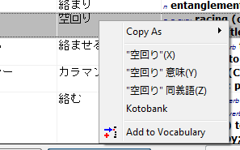

**Information on this page applies to Wakan 1.9+**

If you right-click a dictionary result or open kanji details window, Wakan provides some additional links which open in a browser:

 

These links allow you to quickly look up additional information on an expression or a kanji. Different links are provided in Japanese and Chinese modes.

Advanced users can add their own links to the list.

# Adding custom links
Custom links are stored as URL files in Wakan user data folder (see [Where does Wakan keep my data?](Portable.md)). Reference links shown for a character are in `KanjiLinks\` subfolder and those shown for a word or expression are in `ExprLinks\`. The format is the same.

Each URL file in these folders defines a link. URL files are text files which look like this:
```
[InternetShortcut]
URL=http://www.google.com/search?q=\%22%s:urlencode%\%22
Title="%s"
Hint=Look up "%s" in Google
IconFile=.\google.ico
IconIndex=0
```

Wakan supports standard URL files such as those generated by Internet Explorer, but in most cases you'd want to make some changes.

To edit an URL file, simply open it in Notepad or other text editor.
**Hint.** URL files don't have "Edit" option in Windows. If you don't know a better way, to edit such a file, start Notepad and drag-and-drop the file there.

URL file can contain:

  * `URL`: web address where to go.
  * `Title`: link caption. Optional, file name will be used.
  * `Hint`: hint which is displayed when mouse hovers over a link. Optional.
  * `Language`: one of `A` (All) / `J` (Japanese) / `C` (Chinese) and defines in which modes the link will be shown. Can be omitted, then assumed to be "All".
  * `IconFile`: relative path to icon file, if you want the link to have icon.
  * `IconIndex`: Index of icon in a file (only for .dll; for .ico files just omit or set to 0).

All other params are ignored.

For example, this link:
```
[InternetShortcut]
URL=http://www.google.com/
Title=Google
Hint=Open Google
```
Will always open the main page of Google.


## Character and word references
All of `<caption>`, `<hint>` and `<link>` may contain references to the thing they are shown for:

| |  **Description** | **Example** |
|:|:-----------------|:------------|
| %s | Insert kanji or expression text | "Search %s" -> "Search 展開" |
| \  | Escape character (\% prints "%") | "25\% correct" -> "25% correct" |

You can use as many references in a single string as you like.

Conversions may be applied to the expression, which are chained with ":". The chain of conversions has to end in another "%":

| %s:conversion1:conversion2% | Apply conversions 1 and 2 to kanji or expression and insert it |
|:----------------------------|:---------------------------------------------------------------|

Here's the full set of available conversions:

| **Conversion**     | **Produces** |
|:-------------------|:-------------|
| (no conversion)    | UTF16 (normal text) |
| hex        	       | Hexadecimal representation (e.g. 'A' -> 0041) |
| urlbytes           | Hex + prepend % to every byte: 'A' -> %00%41  |
| ~~urlpairs~~       | Prepend % to every pair of characters: ABCD -> %AB%CD |
| urlencode          | Encode data in a format commonly used in URLs (similar to :utf8:urlbytes, but more nuanced) |
| chprop(id)         | Replace each character with the value of it's property #id (see `[CharInfo]` section of Wakan configuration file) |
| uppercase          | Only valid for normal strings (UTF16, hex). Do not chain after :utf8 or other encodings. |
| lowercase          |              |
| **Encodings**      |              |
| utf8               |              |
| gb2312             |              |
| jis0208            |              |

Conversions are chained, so if you do `%s:utf8:urlbytes%`, utf8 representation of kanji or text will be inserted, encoded as hex separated by % symbols ('あ' -> %E3%81%82).

Each character in Wakan has a set of associated properties which you can browse in Kanji details window. Properties are numbered, the full table of properties is available in `[CharInfo]` section of `wakan.cfg`. There's a special conversion, `chprop`, which accepts a number, property id, and replaces each char with it's property value. For instance:
```
  "乗":chprop(35) -> "3" //Property #35 is a "JLPT Level". JLPT Level for 乗 is 3
```

Common use for this is to pass JIS code `:chprop(57)`, GB code `:chprop(55)` and so on to the sites which expect this in the URL instead of the character itself.

This set of conversions is final and should not be expanded. If you need anything fancy, e.g. "characters encoded as hex minus $66, bytes swapped", write a

  1. Shortcut file
  1. Batch script
  1. Windows scripting host script
  1. Powershell script
  1. Small application
  1. Intermediate PHP script on server

Which accepts kanji/expression/additional properties in one of the formats above and converts it to a fancy format you need.