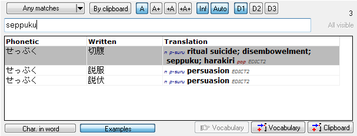
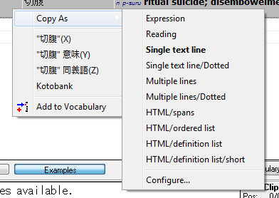
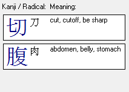
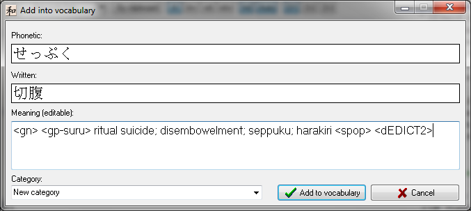

# Dictionary
This window serves as a Japanese-English / English-Japanese dictionary in Japanese mode and as a Chinese-English / English-Chinese dictionary in Chinese mode.

**How to access:** **Dictionary** button on the main control panel. (Also appears in part of the main window when **Translator** button on the main control panel is pressed.)

To search, just enter any expression (English or Japanese in romaji or kanji/kana) in the text field. Results of the search are displayed immediately. **Note:** The number of displayed results may be limited by the window size. To display all results press the "All" button.

By default search goes both ways: by Japanese/Chinese expression and by English definition. You can switch to one of the specialized modes:

  * **Japanese (Chinese) -> English** - Search by romanized Japanese (Chinese) readings.
  * **English -> Japanese (Chinese)** - All Japanese (Chinese) words whose English definitions contain that word or that exact phrase are displayed.

Dictionary supports searching for words containing specified characters, or words starting or ending with specified syllables (for example, words ending with `kata`).

In Japanese mode you can enter inflected forms (like `hatarakimashita`) which are automatically converted to plain form (`hataraku`).

In Chinese mode you do not need to enter tones; for example, you can type just `zhongwen`. Entering tones (e.g. `zhong1wen2`) may be helpful in narrowing results. Only Mandarin Chinese is supported at this moment.

Several romanization systems are supported for each language (Hepburn, Kunreisiki and Czech for Japanese; PinYin, Wade/Giles and Yale for Chinese); see [Romanization settings](Settings.md#Romanization).

**Warning:** Only active dictionaries are searched. You can specify which dictionaries are active in the [dictionary manager](Dictionaries.md#Dictionary_manager).

## Results
Results can be displayed in Roman letters, or in the appropriate phonetic symbols (kana for Japanese, bopomofo for Chinese). This choice can be made in [Romanization settings](Settings.md#Romanization).
Definitions of Japanese words from EDICT may contain various [markers](Dictionary.md#Markers) indicating parts of speech, usage, etc.

Popup menu is available for each of the results which lets you copy it [in a number of formats](CopyFormats.md), or quickly jump to a number of online dictionaries and search sites (see [Custom links](CustomLinks.md)):

One of formats can be selected as default; if you press `Ctrl-C` the result is copied in that format — click `Copy As > Configure...` to choose it. Multiple records can be selected and copied at the same time.

If the word is in vocabulary, then its learned state of each word is shown by different color (unlearned are blue, learned yellow, mastered green and problematic red). You can change learned state in [vocabulary word details](Vocabulary.md#Details).

## Window controls

  * **"A" button** - Searches only for exact matches for the word or phrase entered (for example if you type `mizu` it does not find `mizukara` or `nomimizu`; if you type `just about` it does not find `just about everything`).
  * **"A+" button** - Searches for words beginning with the syllables or phrase entered (for example if you type `mizu` it does find `mizukara` but not `nomimizu`; if you type `just about` in English -> Japanese mode it does find a Japanese word meaning `just about everything`).
  * **"+A" button** - Searches for words ending with the syllables entered (for example if you type `mizu` it does find `nomimizu` but not `mizukara`). This feature is not supported in English -> Japanese (Chinese) mode.
  * **Search by clipboard** - Searches for words by the characters stored in [clipboard](MainWindow.md#Clipboard_viewer).
  *  - Inserts word at the end of the clipboard.
  *  - Displays all results (if all results are already displayed then this button is disabled).

## Secondary windows

  * **Selected word** - Details of selected word.
  * **Chars in word** - Displays information (radical & meaning) about characters contained in word.
  * **Word information** - If the word is in user vocabulary, displays additional information.
  * **Add to vocabulary** - Enables to add word to user vocabulary.

You can alter many your preferences in [settings](Settings.md).

# Markers
Some dictionaries contain grammatical information about words, these are called markers and are displayed in small italic font before and after the meaning.

Markers can be divided into these groups:

  * **Grammatical (G)** (displayed in blue before meaning) - Denote grammatical categories (verbs, nouns, adjectives, ...).
  * **Usage (S)** (displayed in red after meaning) - Information about how and where to use the words.
  * **Special (1)** (displayed in violet before meaning) - Special group categories (like martial arts terms, female speech, ...).
  * **Dictionary (D)** (displayed in grey after meaning) - Dictionary from which the word was taken.
  * **Lesson (L)** (displayed in green after meaning) - If the word is in vocabulary, it denotes its lesson [category](Vocabulary.md#Categories) it belongs to.

Wakan marker list is derived from EDICT/JMdict one, actual version of which is provided in [EDICT documentation](http://www.csse.monash.edu.au/~jwb/edict_doc.html). Markers in wakan sometimes have slightly different names and all the `v*` markers are shown simply as `v` (verb) at this time.

Marker names can be [localized](Localization.md) in which case refer to the localized documentation for the description of their new names.

# Word kanji

This window lists characters in the currently selected word, displaying their meaning and radicals.

## Colors used for characters

  * **Grey** characters are uncommon and should not be generally used.
  * **Black** characters are commonly used.
  * **Green** characters are used only in names.
  * **Blue** characters are marked as learned (you can change this status on the [Details](KanjiDetails.md) subwindow).

# Adding words to vocabulary

You can quickly add selected word into your user vocabulary from this window.

  * **Meaning** - Allows you to change the meaning of the word before entering it into the vocabulary.
  * **Category** - Into which vocabulary [category](Vocabulary.md#Categories) will be the word added.
  * **Add into vocabulary** - Adds the word into vocabulary. If you entered a new category, then a [new category dialog](Vocabulary.md#New_category) will be shown.