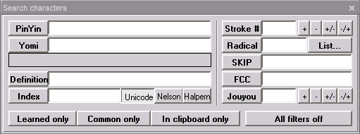
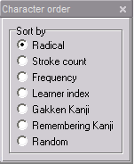
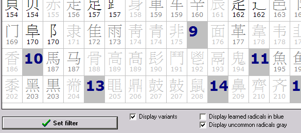

_This page has been ported from the old Wakan help and has not yet been updated. The information may be obsolete_

# Kanji list

This window displays list of characters that were found according to specified search criteria. An individual character on the list is selected by clicking on it.

**How to Access:** **Characters** button on the main control panel, or **Characters window** (Ctrl+K) on the **Characters** menu.

## Parts of the window which can be shown or hidden

  * **[Search & Sort](#Search_&_Sort)** - Tools for finding an individual character or a collection of characters satisfying specified properties, and choosing the order in which the search results are displayed.
  * **[Compounds](#Compounds)** - List of words that contain the selected character.

## Secondary windows

  * **[Print cards](#Print_cards)** - Prints learning cards for displayed characters.
  * **[Character details](KanjiDetails)** - Displays detailed information about the selected character.

In Japanese mode the program displays only characters used in Japan, and in Chinese mode only traditional or simplified characters are displayed (depending on [settings](Settings#Characters)). You can alter the appearance of character list (size of characters, use of colors) in the [settings](Settings#Characters).

## Colors used for characters:

  * **Grey** characters are uncommon and not in general use.
  * **Black** characters are commonly used.
  * **Green** characters are used only in names.
  * **Blue** characters are those which have been marked as learned (you can do this for a selected character in the [Character details](KanjiDetails) window).

**Tip:** Double-clicking on a character adds it to [clipboard](MainWindow#Clipboard_viewer).

# Search & Sort
## Search

Provides tools for searching for a single character, or for a group of characters. Search results are displayed in the Character list.

**How to Access:** Click the Search & Sort button on the Character List window.

Each search parameter has a button and a text box associated to it. If the button is pressed then the associated filter is active.

You can enter more than one value in a text box, separated by commas (`,`) or semicolons (`;`). You can also enter ranges for numeric values. For example typing `1;3;5-8` in the **Stroke #** text box displays only characters with 1,3,5,6,7 or 8 strokes.

Filters:

  * **PinYin** - Display only characters with given PinYin (Chinese reading). You can omit the tone; for example, typing `BA` displays characters with PinYin BA1, BA2, BA3, BA4 or BA5. Any of the Romanization systems (PinYin, Wade-Giles, Yale) may be used; 5, not 0, must be used for specifying neutral tone.
  * **Yomi** - Display characters with given ON or KUN reading (Japanese readings). If you want to search only KUN (Japanese) reading, type `H` before the actual yomi, for example typing `Hka` searches only words with kun reading "ka". For ON-only (Sino-Japanese) searching type `K`. Any of the Romanization systems (Hepburn, Kunreisiki, Czech) may be used.
  * **Definition** - Search by English definition (meaning). Looks for a definition containing the exact text you type in this box.
  * **Other** - Search by the criterion selected using the dropdown combo box (choices include Four Corner Code, frequency, and index numbers in various texts - see [Character information](KanjiDetails)).
  * **Stroke #** - Search by stroke count. You can enter range. Button **-/+** broadens the range and button **+/-** tightens the range (used when you miscount the strokes).
  * **Radical** - Search by radical. You can type the radical number(s) or choose radicals from [radicals list](#Radicals).
  * **SKIP** - Search by [SKIP code](KanjiDetails#SKIP).
  * **Jouyou** - Search by [Jouyou grade](KanjiDetails#Japanese_information).
  * **Sort by** - Determines the order of the characters displayed in the list.
      * **Radical** - Sort by radical and then by stroke count.
      * **Stroke count** - Sort only by stroke count.
      * **Frequency** - Sort by frequency in general text.
      * **Random** - Display characters in random order.
  * **Learned** - Display only characters marked as learned (you can change that in [Details](KanjiDetails) window)
  * **Non-Learned** - Display only characters not marked as learned.
  * **Common only** - Displays only common characters.
  * **In clipboard only** - Displays only characters in [clipboard](MainWindow#Clipboard_viewer).
  * **All filters off** - Displays all characters (toggles off other buttons, and ignores criteria specified by other controls).

## Sort

You can alter the order of the displayed characters in this window.

### Window controls

  * **By radical** - Sort by radical and then by stroke count.
  * **By stroke count** - Sort only by stroke count.
  * **By frequency** - Sort by frequency in general text.
  * **By learner index** - _In japanese mode only:_ Sort by [learner index](KanjiDetails#Japanese_indexes).
  * **By Gakken Kanji** - _In japanese mode only:_ Sort by [Gakken Kanji index](KanjiDetails#Japanese_indexes).
  * **By Remembering Kanji** - _In japanese mode only:_ Sort by [Remembering Kanji index](KanjiDetails#Japanese_indexes).
  * **Random** - Display characters in random order (for printing random learning cards).

## Search tips
[Character search window](#Search_&_Sort) offers many ways to locate an unknown character:

  * **If you know the reading of the character:** Type the reading in the **PinYin** (Chinese) or **Yomi** (Japanese) edit boxes.
  * **If you know the meaning of the character:** Type the english definition of the character in the **Definition** edit box.
  * **If you can count the strokes of the character:** Type the estimate of the stroke count in the **Stroke #** box, if the character does not appear, use **-/+** button repeatedly to broaden the range.
  * **If you can identify some of the parts of the character:** Press the **list** button to bring up [radicals list window](#Radicals). Select all the suspected radicals by clicking on them.

## Radicals

List of radicals.

**How to access:** Open Character List. Click Sort&Search button. Click List button to the right of Radical button.

  * **Display variants** - Displays radical variants (like four dots for fire radical).
  * **Display learned radicals in blue** - Displays characters that are marked as learned in blue. You can change the learned mark by pressing `L` or in the [details](KanjiDetails) window.
  * **Display uncommon radicals in gray** - Dims radicals that contain few characters.

You can double-click on chosen radical to filter by only one or you can select multiple radicals by clicking and then press the button to filter by more radicals. Filtering by multiple radicals is very useful when you do not know exactly what part of the desired character is the radical. You can simply select all suspected radicals.

### Parts of characters
In addition to classical or bushu radicals, Wakan supports searching by any parts of characters. A character can only have one radical, but any number of parts, which makes it easier to locate the character you want without knowing which part of it is a radical.

To search by parts of characters, select "Parts of characters" in the Radicals window and then select any number of character parts.

Note that in this mode, only characters which contain **all the selected parts** are shown (in classical radical mode, characters with **any** of the selected radicals are shown).

# Compounds

Displays list of words that contain the selected character.

  * **Dict.** - Displays words in dictionaries. You can specify which dictionaries to use in the [dictionary manager](Dictionary#Dictionary_manager).
  * **UserDict** - Displays words in user [vocabulary](Vocabulary).
  * **Only beginning** - If checked, displays only words where the character is the first character.
  * **Pop** - Displays only words with **pop** [marker](Dictionary#Markers).

Word readings can be displayed in kana/romaji/PinYin/bopomofo. You can alter this in [settings](Settings#Romanization). Meaning can contain various [markers](Dictionary#Markers).

# Character cards

Character cards printing is useful for learning characters. Each printed page contains several "cards" with useful information about each character (radical, meaning, readings, compounds, printed & calligraphy style).

For information about window controls see [Printing](MainWindow#Printing).

Print output can be highly customized in [settings](Settings#Character_cards).

Readings are printed using the current [romanization settings](Settings#Romanization).