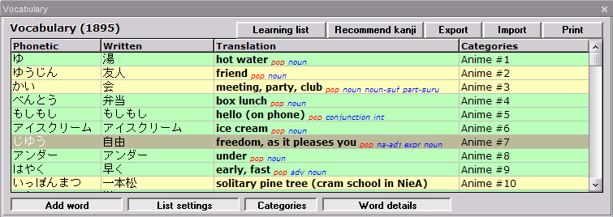
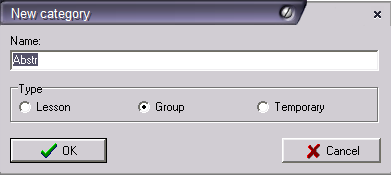
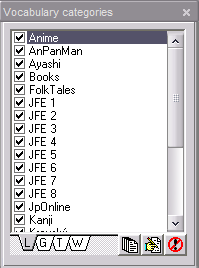

_This page has been ported from the old Wakan help and has not yet been updated. The information may be obsolete_

# Vocabulary

Vocabulary manager offers a convenient way to store, organize and print
your vocabulary.

**Tip:** For information about how to use this program for effective learning see [learning tips](LearningTips).

To add dictionary words into vocabulary use the [words add screen](Dictionary#Adding_words_to_vocabulary). To add user words into vocabulary use the vocabulary add screen (see below).

Word readings can be displayed in kana/romaji/PinYin/BoPoMoFo. You can alter this in [settings](Settings#Romanization). Meaning can contain various [markers](Dictionary#Markers).

## Window controls

  * **Learning list** - Quite complex wizard-style utility that allows you to randomly generate list of words, check whether you know them and finally allows you to store them as a separate category or print them. Follow instructions on the screen to build vocabulary list step-by-step. Please note that learning language by trying to memorize large lists of vocabulary is often not very effective (and certainly very boring), for more information see [learning tips](LearningTips).
  * **Recommend characters** - Stores into [clipboard](MainWindow#Clipboard_viewer) some characters that appear in the vocabulary list and are not yet learned. Characters are selected by complexity and frequency.
  * **Export** - Exports displayed vocabulary list into text file with special [format](FileFormats#Vocabulary_list_export).
  * **Import** - Imports vocabulary list from text file with special [format](FileFormats#Vocabulary_list_export).
  * **Print** - Shows [print preview](PrintPreview) window with the currently displayed vocabulary list. Print properties can be customized in the [settings](Settings#Vocabulary).

## Secondary windows

  * **Add word** - You can add new words into vocabulary in this window. For adding words from dictionary use the [Dictionary word add window](Dictionary#Add_word_to_vocabulary).
  * **List settings** - Allows to set filters or change sort order.
  * **Categories** - Displays categories and allows to filter by them.
  * **Word details - Displays details for selected vocabulary word and allows to change them.**

**Note:** Learned state of each word is shown by different color (unlearned are blue, learned yellow, mastered green and problematic red). You can change learned state in vocabulary word details panel.

**Tip:** You can also use keyboard to change learned states of words. Pressing `L` changes the state to learned, `U` to unlearned, `M` to mastered and `P` to problematic.

# Word details

You can view or change details of the selected vocabulary word in this
window.

# Window controls

  * **Change meaning** - You can change word meaning by this button (you cannot change reading nor writing).
  * **Delete** - Deletes the word permanently from vocabulary.
  * **Arrow buttons** - Moves the word within the category up or down. These buttons work only when sort order is set to "category order".
  * **Set state** - Changes the state of the word.
  * **Categories** - Allows you to add word to some other category or remove it from a category. Each word must belong to at least one category. If you entered a new category, then a new category dialog will be shown.

# Categories
Every word in vocabulary must belong to at least one category. Categories allow you to organize vocabulary words according to various criteria.

There are four types of categories:

  * **Lesson (L)** - Categories of this type denote the source of the word. For example when adding vocabulary of lesson 2 of some textbook, you could add them all to category "Lesson 2" to specify where you got them.
  * **Group (G)** - Categories of this type group words according to some semantic criteria, for example you could create a category "Animals" to include all words denoting animals.
  * **Temporary (T)** - Categories that do not fall into L or G type group, mainly those that are only temporary.
  * **Word lists (W)** - Categories of these type are automatically generated by learning list builder (on vocabulary window), you cannot create them yourself (but you can delete them).

**Tip:** If you do not want to use categories, just add all words to one category.

## New category

Dialog for adding / editing a category.

### Window controls

  * **Name** - Name of the category.
  * **Type** - Category type.

# Filters

You can change sort order or set filters to the vocabulary list in this
window.

  * **Filter** - Only words of the checked states are displayed. You can change learned state in vocabulary word details panel.
  * **Sort** - Changes sort order. In "category order" each word is displayed once in each category.

## Category filter

Shows available vocabulary categories and allows to filter by them.

**Important:** - Please note the four tab buttons below the category list. Each of the tabs represent one category group. Only categories belonging to the selected group are displayed in the above list. You can filter words only by categories belonging to one category group at a time.

Only words belonging to the checked categories are displayed in the vocabulary
list.

### Window controls

  *  - Checks all displayed categories.
  *  - Shows [category edit](Vocabulary#New_category) window.
  *  - Deletes category. Since all words must belong to at least one category you can't delete category that contains words that do not belong to any other category.

# Add word

You can add any word into your user vocabulary by using this window.

## Window controls

  * **Reading** - Romanized reading of the word. Many romanization modes are supported (Hepburn, Kunreisiki, Czech, PinYin, Wade/Giles, Yale), see [romanization settings](Settings#Romanization).
  * **Written** - This field is taken from the [clipboard](MainWindow#Clipboard_viewer).
  * **Meaning** - Meaning of the word.
  * **Category** - Into which vocabulary [category](Vocabulary#Categories) will be the word added.
  * **Add into vocabulary** - Adds the word into vocabulary. If you entered a new category, then a [new category dialog](Vocabulary#New_category) will be shown.
